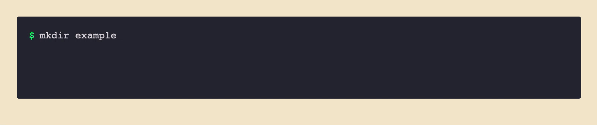

# lightweight-animated-javascript-terminal

A tiny module to animate some HTML `<code>` as a terminal shell or editor.




## Usage

Write and style your terminal session as a container and with a `<code>` tag for each line.

To animate you need to provide a selector for the container with the `<code>` tags and call the `start()` function. Set the `delay.start` option to auto-start on load.

```javascript
const term = Terminal({
  containerSelector: "#terminal",
});

term.start();
```

### Configuration Options w/ defaults

```javascript
const term = Terminal({
  containerSelector: "#terminal", // required
  hideOnLoad: true,               // hide the terminal output on load in preperation to animate
  replayable: true,               // add a replay control after animation
  leaveCursor: true,              // leave a blinking cursor on the last line after animation
  delay: {
    start: 1200,                  // start the animation on load after 1200 milliseconds
    characters: 90,               // millisecondds between each character
    lines: 1000,                  // milliseconds between each line
  },
  callback: () => {               // called after animation has finished
    console.log("finished animation");
  },
});
```

There are a few HTML data attributes for the `<code>` tags:

```
data-term-input & data-term-cursor
<!-- any lines of code with data-term-input attribute will be printed character-by-character and tagged with data-term-cursor for styling -->

data-term-delay
<!-- override the delay before the line is printed - simulate a slow command or output line -->
```

## Notes

- When the terminal is hidden it uses the calculated styles for the width and height - there may be problems if the page is loaded and then resized (responsive styling on the container).
- No default styles (although there is a styled example in [example/](example/css/index.css)).

## Acknowledgements

This originally started as a fork of [github.com/ines/termynal](https://github.com/ines/termynal). I wanted to animate a terminal on a page of mine, but thought I need a few more features (replay control, module, etc.) and an excuse to learn javascript a bit. It became a rewrite as I explored the javascript features and ecosystem.
